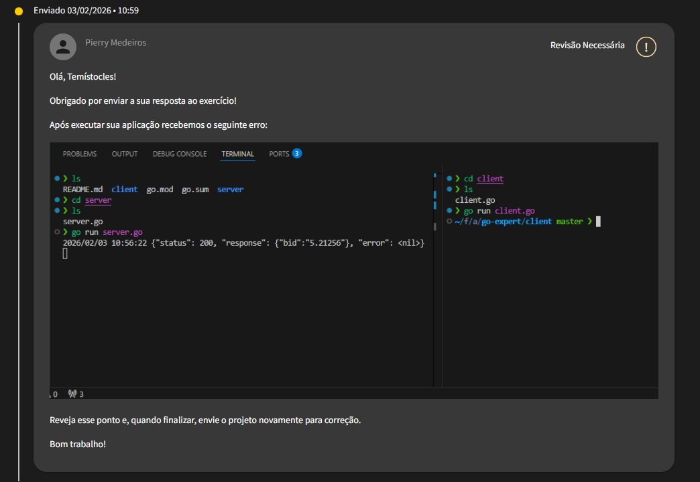

# Inicializar server

- Execute `go run ./server` para iniciar o servidor na porta 8080.

# Inicializar client

- Execute `go run ./client` para iniciar o cliente que se conectará ao servidor na porta 8080.

# Testar comunicação

- O server deverá logar o status da requisição, o response, o erro, e o momento que a request finalizou.
- O client deverá escrever no arquivo `cotacao.txt` o valor retornado pelo servidor no formato esperado.
- O arquivo `cotacoes.db` deve poder ser aberto em uma ferramenta como https://inloop.github.io/sqlite-viewer/ que permita visualizar o conteúdo do banco de dados SQLite.

# Definição do projeto client server

Olá dev, tudo bem?

Neste desafio vamos aplicar o que aprendemos sobre webserver http, contextos,
banco de dados e manipulação de arquivos com Go.

Você precisará nos entregar dois sistemas em Go:

- client.go
- server.go

Os requisitos para cumprir este desafio são:

O client.go deverá realizar uma requisição HTTP no server.go solicitando a cotação do dólar.

O server.go deverá consumir a API contendo o câmbio de Dólar e Real no endereço: https://economia.awesomeapi.com.br/json/last/USD-BRL e em seguida deverá retornar no formato JSON o resultado para o cliente.

Usando o package "context", o server.go deverá registrar no banco de dados SQLite cada cotação recebida, sendo que o timeout máximo para chamar a API de cotação do dólar deverá ser de 200ms e o timeout máximo para conseguir persistir os dados no banco deverá ser de 10ms.

O client.go precisará receber do server.go apenas o valor atual do câmbio (campo "bid" do JSON). Utilizando o package "context", o client.go terá um timeout máximo de 300ms para receber o resultado do server.go.

Os 3 contextos deverão retornar erro nos logs caso o tempo de execução seja insuficiente.

O client.go terá que salvar a cotação atual em um arquivo "cotacao.txt" no formato: Dólar: {valor}

O endpoint necessário gerado pelo server.go para este desafio será: /cotacao e a porta a ser utilizada pelo servidor HTTP será a 8080.

Ao finalizar, envie o link do repositório para correção.

# Review

- Olá Pierry, você anexou a seguinte revisão:

- Qual erro você recebeu? No print anexado não há erros. Mas pode haver uma falha de comunicação. Vou tentar abordar os pontos que possam ter causado esta falha, por favor me explique melhor qual o cenário.

1. Há um log da chamada no `server.go` que tem o termo `"error": <nil>`. Bom, isto significa que não houve nenhum erro, por mais que o termo `error` apareça nos logs.
2. O client fez uma request, e encerrou. Me perdõe se fui literal demais, mas a definição é:
   > O client.go deverá realizar uma requisição HTTP no server.go solicitando a cotação do dólar.

Como não entendi qual critério não foi aceito, documentei aqui o que pode ter causado este desencontro. Obrigado.
